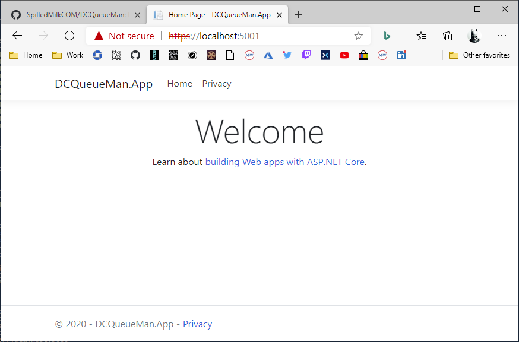

# DCQueueMan

A template for Dave's queue manager.  I'm a **HUGE** DC fan, so this sounds like a new super hero. "Queue Man" or "Queueman" *(sounds like human)**.

## Getting Started

* `dotnet new mvc` - Creates the template using the name of the current directory as the project name.
* `dotnet run` - Runs the app and hosts on `localhost` which will display when you run.

For now this is just an MVC app so the code and endpoints can be easily tested and values can be displayed.  The API can be added later.

## :books: References

* [dotnet new](https://docs.microsoft.com/en-us/dotnet/core/tools/dotnet-new)
* [Mastering Markdown](https://guides.github.com/features/mastering-markdown/)
